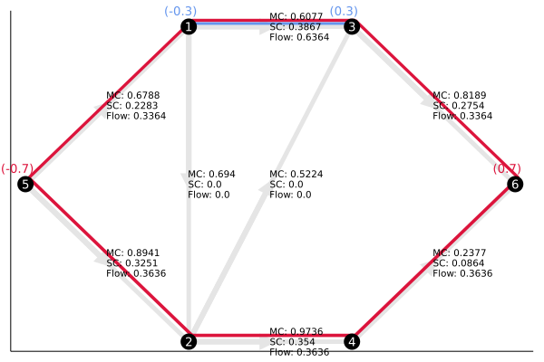

# NonatomicRouting.jl

Max Kapur | [https://www.maxkapur.com](maxkapur.com)

This repository considers *nonatomic routing games,* a class of optimization problem that has been studied since the 1920s and has gained importance in recent decades because of its applications in modern city infrastructure and communications network design.

A nonatomic routing game consists of a directed graph $G$, cost functions $c_e$ associated with each edge of the graph that give the unit cost of flow along that edge, and a vector of demands $r$ associated with various entering and exit nodes. Typical optimization tasks include computing the socially *optimal* flow, which is the flow that minimizes the total cost that everyone experiences on every leg of their journey, and computing an *equilibrium* flow, which incentivizes no player to change their route. The notebook `NonatomicRouting.ipynb` contains a somewhat longer discussion and an example. 

## What&rsquo;s in the package
The file `NonatomicRouting.jl` includes some Julia tools I have developed for working with nonatomic routing games. The most important elements are
- The struct `RoutingGame`, which stores static information about a routing game.
- The constructor `RoutingGame()` that takes edges, costs, origin&ndash;destination pairs, and the demand vector as an input, automatically computes the possible paths for each demand class, and returns a `RoutingGame` instance. Currently, only polynomial cost functions are supported. 
- The function `solveroutinggame()`, which computes the optimal and equilibrium flows and prints the price of anarchy.
- The function `shownet()`, which displays the network in a graphical format given a list of node locations. Optionally, it can also display a flow in the format returned by `solveroutinggame()`.
- The function `pathcosts()`, which evaluates the marginal cost in with the network at a certain flow state and prints the result in a format conducive to incentive analysis. 

There are also a few helper functions that may be of independent interest:
- `findstpath(edges, s, t)` returns an index of edges for a path from `s` to `t`, found using lexicographical depth-first search.
- `findpaths(edges, s, t)` finds *all* paths from `s` to `t` and returns their indices using recursive breadth-first search. Generally, the number of s&ndash;t paths is exponential in the graph size, so this function, and `NonatomicRouting.jl`, are inappropriate for large graphs.

I focused on building a high-level interface, while leaving the work of optimization to `JuMP.jl` and `Ipopt.jl`. However, the underlying optimization problems are complex in notation only. Given a correct representation of the problem data, it is usually effective to solve them using a standard minimization procedure such as [projected gradient descent](https://gist.github.com/maxkapur/2c90eafc99834c3bf2ed6a2da37e657a) with inexact line search and a log barrier. 

## Reference
Roughgarden, Tim. &ldquo;Routing Games.&rdquo; Chap. 18 in *Algorithmic Game Theory,* edited by Noam Nisan, Tim Roughgarden, Eva Tardos, and Vijay V. Vazirani. Cambridge University Press, 2007.